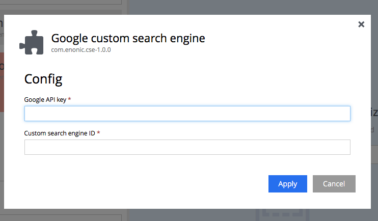

# Google Custom Search APP

## Releases and Compatibility

| App version | Required XP version |
| ----------- | ------------------- |
| 1.0.0 | 6.6.0 |

## Usage

### Install cse

Install cse to the local maven repository.

    ./gradlew deploy

### API-key and engine id

To be able to get search result from Google, you need an api-key and a search engine id from Google. The api-key is obtained by setting up an credention at Googles [API manager](https://console.developers.google.com), and enabling the "custom search API".

Get the search engine id by register an engine at Googles [custom search engine console](https://cse.google.com).

### Site config

In the siteconfig for the app, apply your API-key and search engine id.

### Parts

There are 2 sets of different parts to choose from. The CSE search and result parts, and the CSE custom search and result parts.

#### CSE Search and result parts
This is the quickest way to add cse to your site. Simple add the search field part to any page. Your settings in the [custom search engine console](https://cse.google.com) will manage how the search result will be shown.

If you want the search result on a different page, add the "CSE search result" part to the destination page, and link to it in the "CSE search field" part config.

#### CSE custom search and result parts

If you want to manage the css and behavior to the searchfield and result, you can use these parts. The custom search field provide an input and a submit/search button.

The custom search result is a very flexible. You need to choose which fields from the search result, from google, you want to show. When you choose a field, you also choose what kind of html-tag this field is going to be wrapped in. Choose between h2 - h6, span, p and a tags. You can add classes to the tag as well. Also choose which html-tag is goin to wrap the results. Choose between ol, li, div or article.

Add styling in your own app, that applies to the html elements and classes you set to make the search result exaclty how you want it.
